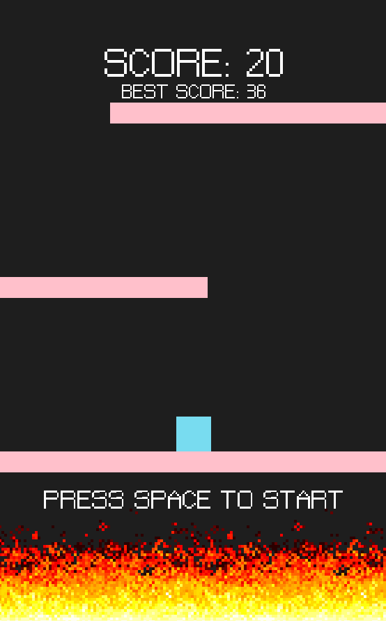

<p align="left">
<!--  -->

</p>


# 🎮 Controls
| Key       | Action                                                      |
|---------- |-------------------------------------------------------------|
| `d`       | Move to the right                                           |
| `a`       | Move to the left                                            |
| `SPACE`   | Jump/Start game                                             |
| `ESC`     | Exit game                                                   |

# ⚙️ How to run

## MacOs
### Dependencies
- [clang]
- [sdl2]
- [sdl2_ttf]

```console
$ ./build.sh
$ ./build/main
```

## Windows MSVC
### Dependencies
- [MSVC 2015+][visual-studio]

```console
> .\setup_dependencies.bat
> .\build_msvc.bat --release
> cd .\build
> .\main.exe
```

## Other
For other platforms I provided CMakeLists.txt for use with [cmake]

```console
$ mkdir ./build
$ cd build
$ cmake .. -Drelease=true
$ cmake --build ./
```

# 🔤 Font
https://www.1001fonts.com/the-jewish-bitmap-font.html

[visual-studio]: https://www.visualstudio.com/
[clang]: https://clang.llvm.org/
[cmake]: https://cmake.org/
[libsdl2-dev]: https://www.libsdl.org/
[sdl2]: https://formulae.brew.sh/formula/sdl2
[sdl2_ttf]: https://formulae.brew.sh/formula/sdl_ttf
